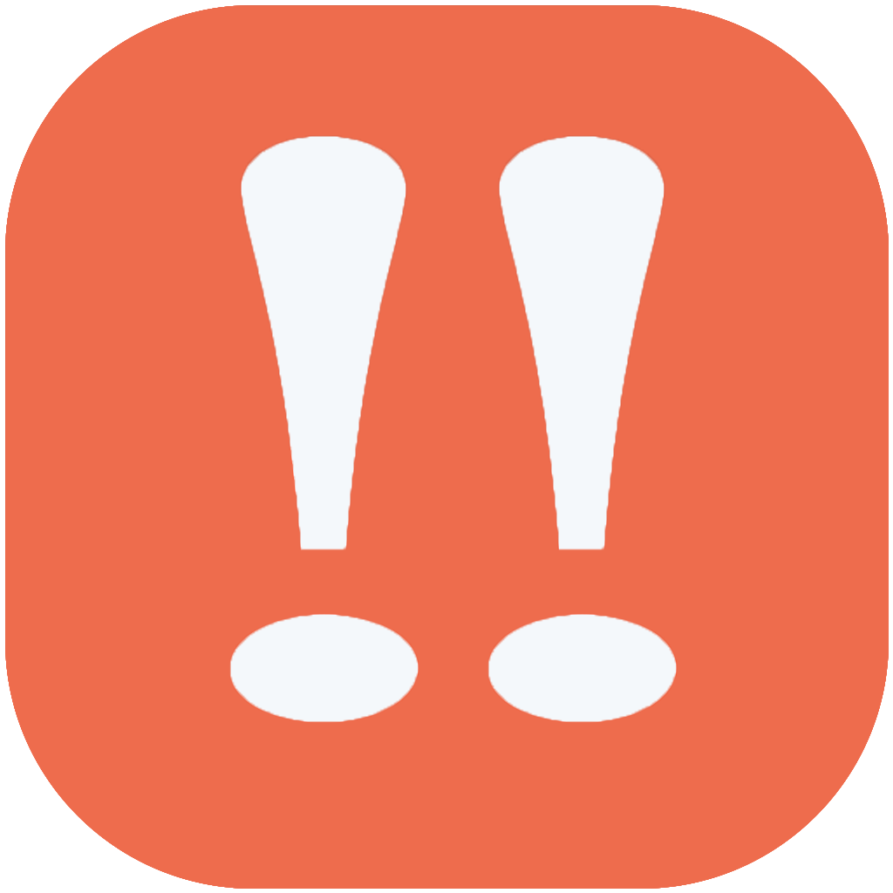

# Só Vai!!

> Um app pra te auxiliar a manter suas metas em dia!!

![Version][version]

App feito em React Native para acompanhamento diário de metas, tanto pessoais quanto profissionais, com schedule de notificações locais e integração com o Firebase.

> **Disponível apenas para Android.**



<a href='https://play.google.com/store/apps/details?id=com.claudio.sovai&pcampaignid=MKT-Other-global-all-co-prtnr-py-PartBadge-Mar2515-1'></a>

## Configuração para Desenvolvimento

```sh
npm install
npm run android
```

## Histórico de lançamentos

- 0.0.1
  - Trabalho em andamento

## Autor

Claudio Junior – [@ClaudioVsJunior](https://twitter.com/ClaudioVsJunior) – claudio.1091@gmail.com

Distribuído sob a licença MIT. Veja `LICENSE` para mais informações.

[https://github.com/claudio1091](https://github.com/claudio1091)

## Contribuição

1. Faça o _fork_ do projeto (<https://github.com/claudio1091/SoVaiApp/fork>)
2. Crie uma _branch_ para sua modificação (`git checkout -b feature/fooBar`)
3. Faça o _commit_ (`git commit -am 'Add some fooBar'`)
4. _Push_ (`git push origin feature/fooBar`)
5. Crie um novo _Pull Request_

[version]: https://img.shields.io/badge/version-1.0.1-orange.svg
[npm-url]: https://npmjs.org/package/datadog-metrics
